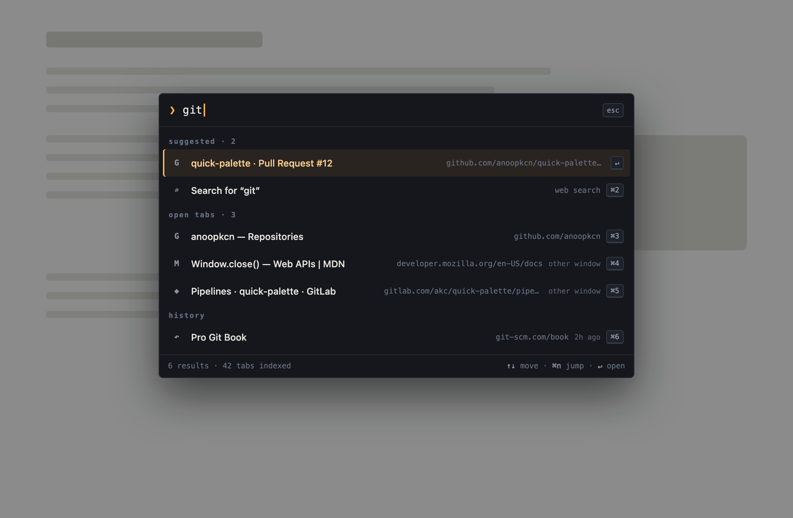

# Quick Palette

A keyboard-first command palette for Chrome, inspired by Arc's command bar.

It can:

- Switch to any open tab, including tabs in other windows
- Rank tabs using match quality, recency, window context, pinned state, and locally learned palette choices
- Search browsing history and bookmarks
- Browse history and bookmarks inside the palette and pick or mark items to open
- Search with Chrome's default search engine
- Open URLs directly
- Create tabs, windows, and incognito windows
- Open common Chrome pages such as Downloads, Extensions, and Settings
- Close open tabs from the result list
- Copy the current tab URL from the palette or a configurable keyboard shortcut

## Install

1. Open `chrome://extensions` in Chrome.
2. Enable **Developer mode**.
3. Click **Load unpacked** and select this directory.
4. Press `Command+Shift+K` on macOS or `Ctrl+Shift+K` on Windows/Linux, or click the toolbar icon.

Chrome may leave the shortcut unassigned if another extension or browser feature already uses it. Open `chrome://extensions/shortcuts` to assign or change the shortcut.

The **Copy current tab URL** shortcut is unassigned by default. Assign any supported key combination to it at `chrome://extensions/shortcuts`.

## Use

- Start typing to filter open tabs and search history/bookmarks.
- Use the up/down arrow keys to move through results.
- Press Enter to open the selected result.
- Press Tab to mark several history or bookmark results (Shift+Tab marks and moves up). With marks set, Enter opens every marked result in a background tab, and Escape clears the marks.
- Select **History** or **Bookmarks** to browse those items inside the palette — type to filter, mark and open as usual, and press Backspace (with an empty query) or Escape to go back.
- Press Escape or click outside the palette to close it.
- Hover a tab result and click the close button to close that tab.
- Search for **Reset learned tab ranking** to clear locally stored ranking preferences.

The palette opens as the extension's toolbar popup, so it works the same on every page — including `chrome://` pages, the new tab page, and the Chrome Web Store. In incognito windows the shortcut only works if **Allow in Incognito** is enabled for the extension.

## Development

There is no build step. After changing `manifest.json` or `background.js`, click the extension's reload button on `chrome://extensions`. Changes to `palette.html` or `palette.js` take effect the next time the popup opens.

Run the automated tests with `node --test tests/*.test.js`.
